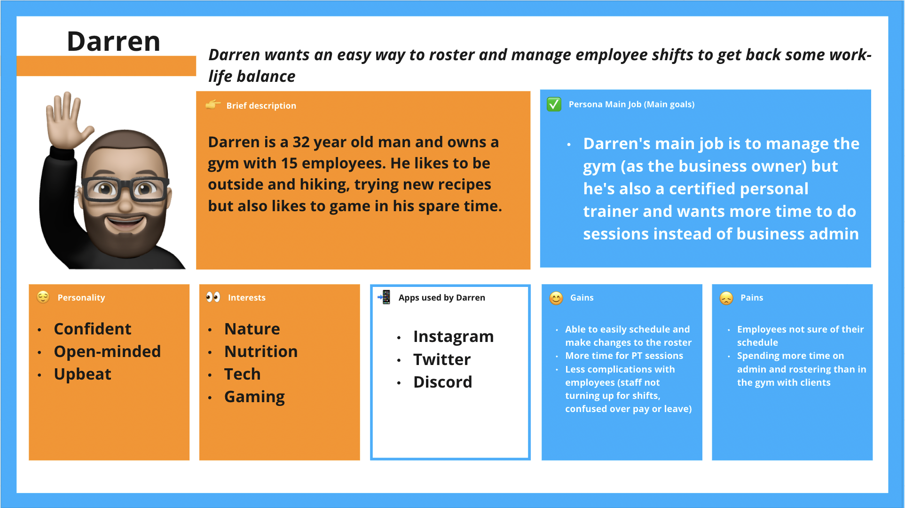
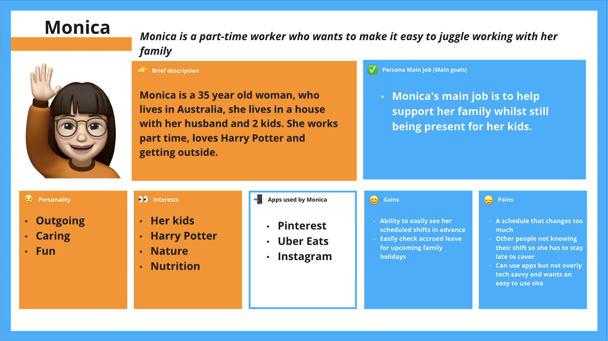
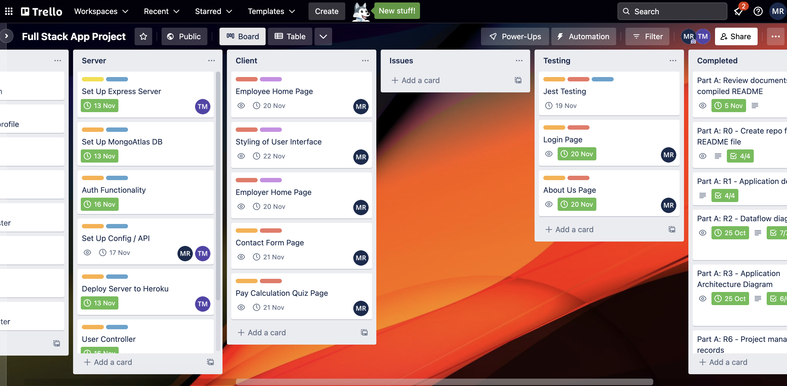
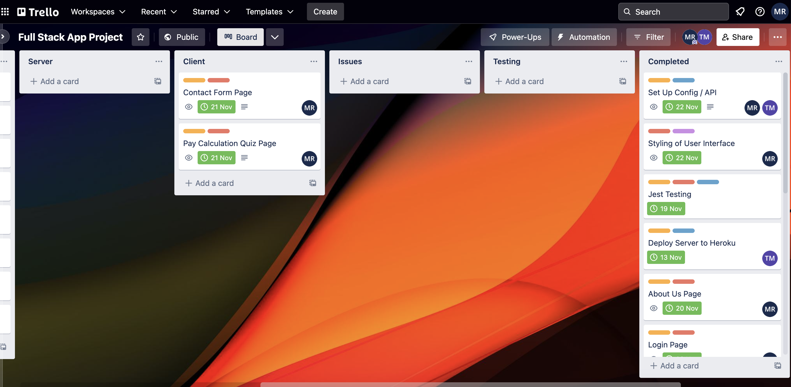
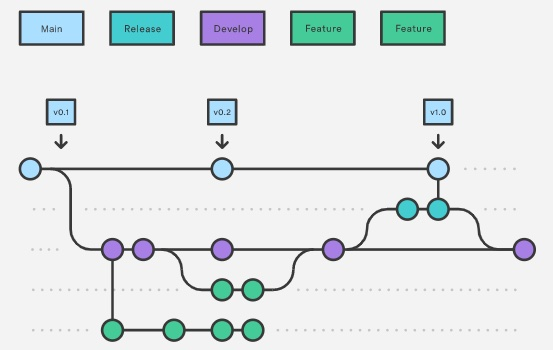

### Timotius Mogot and Morgan Rohan T3A2 - Part B
# EasyPortal Business Management System Full Stack App

## Authors
Timotius Mogot ([Github](https://github.com/Sky12072))
  Morgan Rohan ([Github](https://github.com/MorganRohan))

## Important Links
Deployed frontend and backend urls:

Front-end React: https://www.easyportal-businessmanagement.com/

Back-end Expressjs: https://easyportal-heroku.herokuapp.com/

Client Repository: https://github.com/EasyPortal-Business-Management-System/EasyPortal-Client 

Server Repository: https://github.com/EasyPortal-Business-Management-System/EasyPortal-Express 

Part A Documentation Repository: https://github.com/EasyPortal-Business-Management-System/Part-A-docs

EasyPortal is system that focuses on providing easy to use and exciting business management functions such as setting rosters and communicating pay information.

## Installation Instructions
To use the production app, please visit (link) and use in browser. If you would like to use the app locally, you can follow the instructions below.

Requirements:
- Node.js v15.12.0 and you can view documentation [here](https://nodejs.org/en/download/)
- MongoDB and you can view documentation [here](https://www.mongodb.com/docs/guides/crud/install/)

EasyPortal has both client and server repositories, which require being downloaded and run separately, but do communicate with each other. 

Server:
- Create a directory from your terminal (EasyPortal is a good name) and `$ cd` into it.
- Once in the directory, you can use the command `$ git clone https://github.com/EasyPortal-Business-Management-System/EasyPortal-Express.git`
- `$ cd` into the folder (called EasyPortal-Express)
- Install npm packges by using  `$ npm install`
- Check that Mongo is running locally
- From bash, run `$ npm start` to start the local server
- The server will run on http://localhost:55000/ and when opened in the browser, it should display a 'woohoo!'

Client: 
- `$ cd` into the EasyPortal directory (either back up from the server folder by using `$ cd ..` down into it using `$ cd EasyPortal`) and clone the client repository into it using `$ git clone https://github.com/EasyPortal-Business-Management-System/EasyPortal-Client.git`
- `$ cd` into the folder (called EasyPortal-Client)
- Install npm packages by using `$ npm install`
- From bash, run `$ npm start` to start to local client
- A new browser window should open, with the client running on http://localhost:3000/
- Check that the server is connected at http://localhost:55000/
- Enter the portal!

## Contents:
- [Description](#description)
- [Functionality and Features](#functionality-and-features)
- [Tech Stack](#tech-stack)
- [Libraries and Dependencies](#libraries)
- [API Endpoints](#api-endpoints)
- [Testing](#testing)
- [Screenshots](#screenshots)
- [User Stories and Client Interaction](#user-stories)
- [Project Management and Task Delegation](#project-management)
    -[Project Retrospective](#retrospective)

 
 

## Description

 

## Functionality and Features
- Employee log in to view own roster and pay information
- Employer log in to view employee register and roster information
- Roster employees
- Access to employee register and overview (For employer login)

***The following features were originally planned to be implemented (see Part A) but ended up being put aside in order to prioritise the primary focus of the rosters.*** 
- ‘At a glance’ graphics for employees
    - View worked hours
    - View estimated pay
- Upload documents (police check, identity check, employer references) 

 

### Tech Stack
#### Front-end:
- HTML
- JavaScript
- CSS
- React

#### Back-end:
- Express
- Node.js 

#### Database:
- MongoDB
- Mongoose

#### Deployment:
- Netlify
- Heroku

#### Project Management Tools:
- Trello
- Discord

#### Testing:
- Postman
- Jest
- Cypress

#### DevOps Tools:
- Git
- GitHub
- Visual Studio Code

#### Design Tools:
- Figma
- Lucidchart
- Miro

 

## Libraries and Dependencies
#### Client Libraries and Dependencies
- `cypress ^11.1.0` - Cypress is an end to end testing framework for anything that runs in the browser. Cypress has been used in the application for integration test between the front and back end.
- `react ^18.2.0` The client side of EasyPortal has been built primarily using React, which is a JavaScript library for building user interfaces.
- `react-dom ^18.2.0` - ReactDOM is a package that helps to manage the DOM elements and enable for rendering components in the browser. 
- `react-router-dom ^6.4.3` - Helps to control routing and allows for a Single Page Application to be built that still acts like a larger site with multiple pages. 
- `react-scripts 5.0.1` - Simply scripts used to run the tools required to transform REact jsx into plain JavaScript.
- `@mui/material ^5.10.13` - Material UI (shortened to mui) is a component library with ready-to-use foundational REact copmonents. 
- `axios ^1.1.3` - Axios is a promised-based HTTP client for JavaScript and helps to make the HTTP requests (such as GET, POST) and handle the request and response of the data. 

#### Server Libraries and Dependencies
- `express ^4.18.2` - Express has been used for the server side of this application, it's a Node.js web application framework and helps to build Single Page Applications such as this one. It's a layer built on top of the Node.js and helps manage servers and routes. 
- `mongoose ^6.7.2` - Mongoose is an Object Data Modelling (ODM) library for MongoDB and Node.js. It manages the relationships between data, provides schema validation and can be used to translate between objects in code and the representation of those objects in MongoDB.
- `cors ^2.8.5` - CORS is a node.js package for middleware that enables cross origin resource sharing between the Express server and React client.
- `nodemon ^2.0.20` - Nodemon is a utility that will monitor for changes to the source and automatically restart the server appropriately. It's used in the development environment. 
- `dotenv ^16.0.3` - Dotenv is a zero-dependency module that loads environment variables from a .env file into a process.env file. 
- `helmet ^11.2.0` - Helmet is used to secure HTTP headers returned by Express and i a Node.js module. 
- `firebase ^9.13.0` - Firebase was used to handle the authentication processed within the app. It's a Backend-as-a-Service and provides developers with authentication tools to help simplify the development process. 

 

## API Endpoints

#### Authentication
- POST /users/register
- POST /users/sign-in
- POST /users/sign-up

#### Rosters 
- GET /employees
- GET /employees/:id
- POST /employees
- DELETE /employees/:id
- PATCH /employees/:id

 

## Testing 
The application has been tested locally in Chrome and Safari on Mac OS Ventura 13.0.0.

The development and production applications have both been tested manually through Postman, along with Jest and Cypress. The test files can be found and run from the respective repositories for each side of the project. 

Manual test logs: http://bit.ly/3AEP82H 

 

## Screenshots

 

## User Stories and Client Interaction
The user stories below are focused on the needs and experiences of the employees and employers who would be using the EasyPortal application. In the Part A documentation, a more extensive list can be found, whereas the stories below better reflect the final production of the application. 

We will discuss this further in the project retrospective, but at this stage the deployed application is not at the functinoality we wanted to deliver to the client. We have been in communication with the client to update them on the current status and are discussing future options. 

#### Employee:
- As an employee, I want to be able to easily check my roster without having to go into my workplace.
- As an employee, I want a site that is easy to navgate so that I don't have to spend a lot of time checking my roster. 

 

#### Employer:
- As an employer, I want to be able to view the current employee roster, so I can see how well staffed my business is. 
- As an employer, I want to be able to add a new shift to the roster.
- As an employer, I want to be able to edit an existing shift in the roster.
- As an employer, I want to be able to delete an existing shift in the roster.
- As an employer, I want my employees to be able view their roster, so I know they can see their shifts.

 

#### User Persona 1:

- As the gym owner, I want to easily make roster changes, so that I can spend less time doing business administration.
- As the gym owner, I want to use a business management system, so that my employee information is all in one place.
- As the gym owner, I want to spend less time making roster changes, so that I can spend more time training with clients.
- As the gym owner, I want to have my business management system on my work computer, so that I can get more work-life balance.
- As the gym owner, I want to more clearly communicate roster information, so I can reduce miscommunication with my employees.

 

#### User Persona 2:

- As a working parent, I want to check my roster easily, so that I can balance my work with spending time with my kids.  
- As a working parent, I want to know my roster, so that I can make sure I have weekends off to go camping with my family. 

 

#### User Persona 3:

- As a student, I want to know what my roster is in advance, so that I can attend my uni classes.
- As a casual worker, I want to easily view changes to my roster, so that I can make plans with friends. 

 

## Project Management and Task Delegation
The team focused on having a strong and straight forward development plan with clear management of the project. Sprint one of the project was the intial planning stage and the end was marked with the submission of the Part A documentation. Part of this planning process included creating a comprehensive Trello board and clear plan for task delegation. The tasks were broken down into the Client and Server buckets, with the vital components of each separated out into smaller action cards. Due dates were then assigned to each card based on what was considered most important to do first, or what might take the most time. Allocation was fairly straightforward, with each team member taking responsiblity for one side of the project. 

We decided to use the remaining three weeks of the timeline as the outline for three major sprints to the end of the project. Main working days were decided as the Monday, Tuesday and Wednesday of each week, with a morning stand up and afternoon check in. Both of these allowed for the opprtunity to review the Trello board, set the task or tasks for the day and discuss any areas of particular difficulty. 

Trello was used as the main method of tracking tasks and team member delegation, with Discord being used as the main form of communication. All of the screenshots from the working day catch ups can be found [here](./docs/Trello_screenshots/). 

#### Sprint 1
Following the planning covered in Part A, the first sprint focused on covering the ground work of the code and building a skeleton front end and back end to build on in the later sprints. This meant focusing on setting up MongoDB and Firebase for the back end, as well as the base components in React for the front end.

#### Sprint 2
The second sprint focused on building the front end to include the components needed for the application features, as well as establishing authorisation. Back end deployment was also a focus, in order to try and provide an easier front end development environment. Manual unit testing was used in this sprint to help determine which components within both the front and back end were working before moving on. 

#### Sprint 3
The third and final sprint focused on implementing the CRUD functionality required for managing the roster and employee information. Whilst the front end components were built and mostly working using the dummy data, configuring the API and services to connect to the server proved to be quite a blocker for the team. It was identified that the interaction between MongoDB and Firebase was more difficult than anticipated and required refactoring the functions and routes to correctly attach the data to the users. Calling this data to the front end to then manipulate ended up being a large issue for the application and at the beginning of the sprint, it was decided to drop the other functionalities in order to solely focus on this working. 

Unfortunately at time of deployment, the roster system in the  application is not fully functional. As a team, we were disappointed that we were unable to get this working within the timeline and deliver it to the client as expected. In the spirit of honesty, the team contacted the client halfway through the sprint and presented a progress report to demonstrate how the application was working. We will discuss the outcome of this in the retrospective section below. 

Alongside the project management, the team discussed how the workflow would be best used in order to manage changes from each collaborator. For this it was decided that a Gitflow workflow would work best for the team and kanban methodology of the project. This involved establishing a central repository with the main branch (deployed version of the application), development branch (for a working or staging version of the application) and feature branchs for each new feature or function of the application. We decided on this in order to best suit the division of workload within the project and to minimise merge conflicts. The diagram below shows an example of how the workflow was used for the project:
 

### Project Retrospective

Overall, the development team are proud of what they have created but disappointed that we have not delivered full functionality at this time. As discussed, we have been in discussion with the client and have set a revised delivery date of 8th December for the core rosters functionality. 

### Bibliography
Atlassian (no date) Gitflow workflow: Atlassian Git Tutorial, Atlassian. Available at: https://www.atlassian.com/git/tutorials/comparing-workflows/gitflow-workflow (Accessed: November 4, 2022). 
