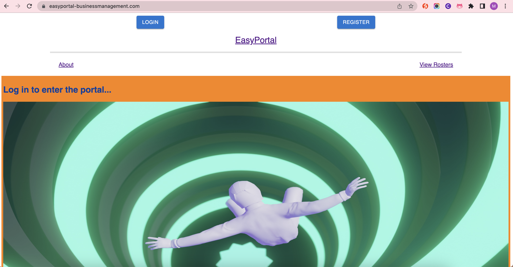
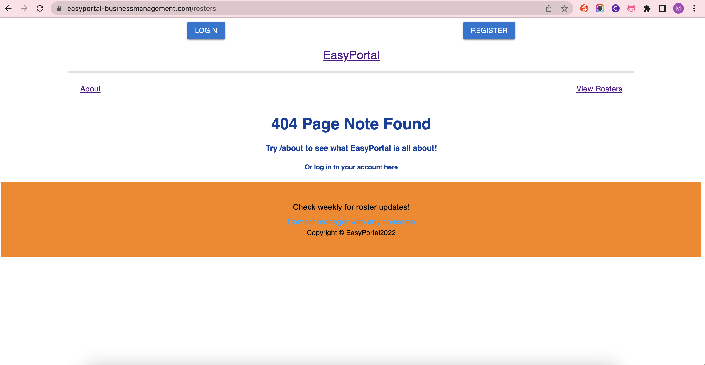
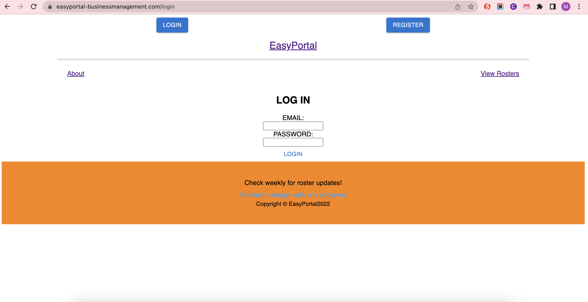
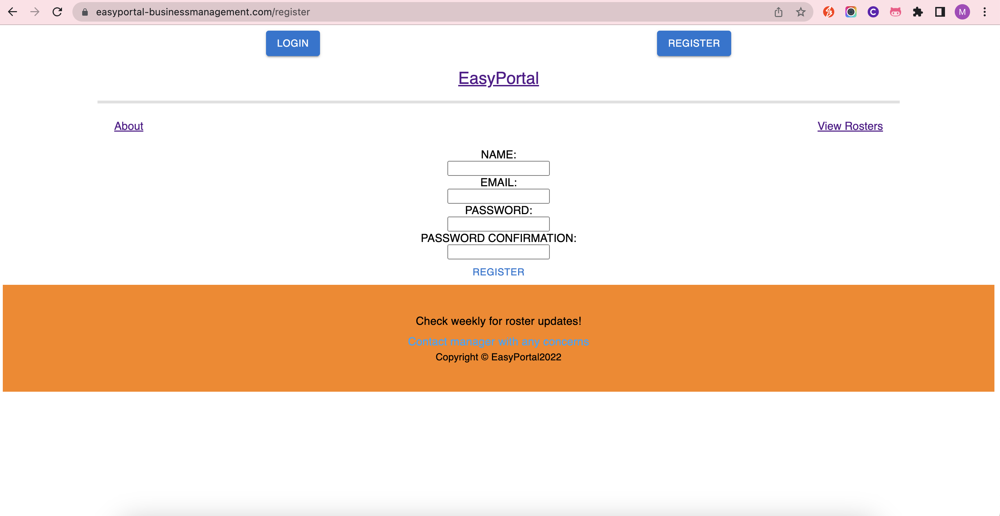
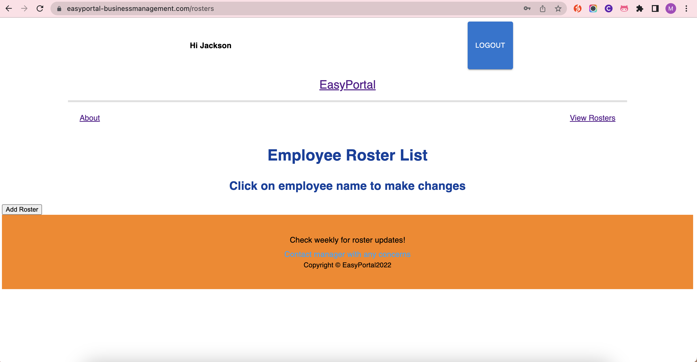
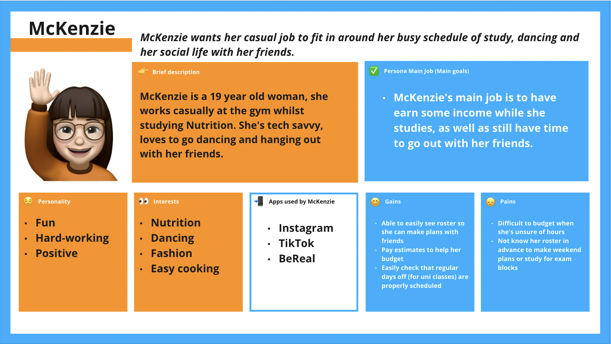
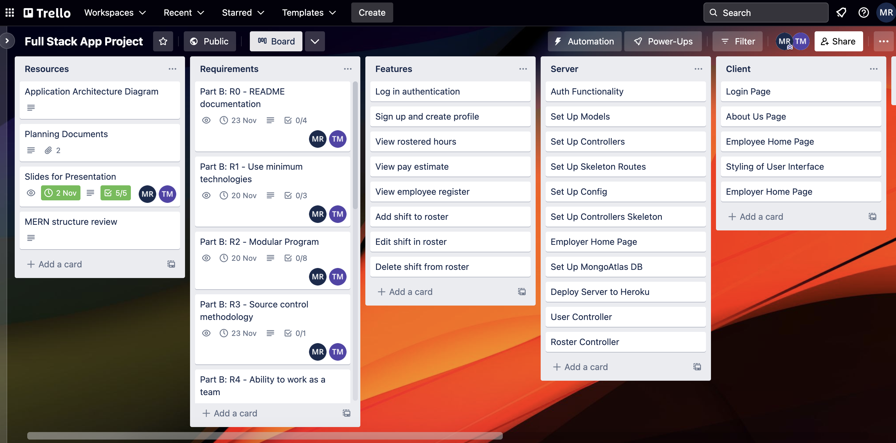

### Timotius Mogot and Morgan Rohan T3A2 - Part B
# EasyPortal Business Management System Full Stack App

## Authors
Timotius Mogot ([Github](https://github.com/Sky12072))
  Morgan Rohan ([Github](https://github.com/MorganRohan))

## Important Links
Deployed frontend and backend urls:

Front-end React: https://www.easyportal-businessmanagement.com/

Back-end Expressjs: https://easyportal-heroku.herokuapp.com/

Client Repository: https://github.com/EasyPortal-Business-Management-System/EasyPortal-Client 

Server Repository: https://github.com/EasyPortal-Business-Management-System/EasyPortal-Express 

Part A Documentation Repository: https://github.com/EasyPortal-Business-Management-System/Part-A-docs

EasyPortal is system that focuses on providing easy to use and exciting business management functions such as setting rosters and communicating pay information.

## Installation Instructions
To use the production app, please visit (link) and use in browser. If you would like to use the app locally, you can follow the instructions below.

Requirements:
- Node.js v15.12.0 and you can view documentation [here](https://nodejs.org/en/download/)
- MongoDB and you can view documentation [here](https://www.mongodb.com/docs/guides/crud/install/)

EasyPortal has both client and server repositories, which require being downloaded and run separately, but do communicate with each other. 

Server:
- Create a directory from your terminal (EasyPortal is a good name) and `$ cd` into it.
- Once in the directory, you can use the command `$ git clone https://github.com/EasyPortal-Business-Management-System/EasyPortal-Express.git`
- `$ cd` into the folder (called EasyPortal-Express)
- Install npm packges by using  `$ npm install`
- Check that Mongo is running locally
- From bash, run `$ npm start` to start the local server
- The server will run on http://localhost:55000/ and when opened in the browser, it should display a 'woohoo!'

Client: 
- `$ cd` into the EasyPortal directory (either back up from the server folder by using `$ cd ..` down into it using `$ cd EasyPortal`) and clone the client repository into it using `$ git clone https://github.com/EasyPortal-Business-Management-System/EasyPortal-Client.git`
- `$ cd` into the folder (called EasyPortal-Client)
- Install npm packages by using `$ npm install`
- From bash, run `$ npm start` to start to local client
- A new browser window should open, with the client running on http://localhost:3000/
- Check that the server is connected at http://localhost:55000/
- Enter the portal!

## Contents:
- [Description](#description)
- [Functionality and Features](#functionality-and-features)
- [Tech Stack](#tech-stack)
- [Libraries and Dependencies](#libraries-and-dependencies)
- [API Endpoints](#api-endpoints)
- [Testing](#testing)
- [Screenshots](#screenshots)
- [User Stories and Client Interaction](#user-stories-and-client-interaction)
- [Project Management and Task Delegation](#project-management-and-task-delegation)
    - [Project Retrospective](#project-retrospective)

 
 

## Description
EasyPortal is designed as an employee and employer portal, allowing for an easy-to-use and fun experience for all things business management. It's core focus is on the ability to handle rosters for employees and has the scope to expand to communicating pay information, leave requests or even performance reviews. 

It was created in response to an issue facing our client, Darren, a small business owner with a gym. At present, he currently has a whiteboard in the office of the gym where he writes up the employee shifts for the week. This means that in order for an employee to know their shifts for the week, they need to remember to check the board whilst on site or call to find out. This has resulted in a number of miscommunications and days where the gym has been short staffed. 

As a small business, he is the sole owner and only employs a part-time bookkeeper to process the payroll, meaning that most employee questions about pay details also fall to him. Since there are full-time, part-time and casual employees at the business, it ends up being a lot of information to keep on top of. All of this means that Darren spends a lot of his time on business administration instead of in the gym with clients, which is what he really loves. EasyPortal was planned and developed to respond to this issue and provide a fun, interactive alternative to existing similar softwares. It was also designed with a small business structure being considered, keeping the software small and light to start with, with the ability to scale up and add more features in the future. 

 

## Functionality and Features
- Employee log in to view own roster and pay information
- Employer log in to view employee register and roster information
- Roster employees
- Access to employee register and overview (for employer login)

***The following features were originally planned to be implemented (see Part A) but ended up being put aside in order to prioritise the primary focus of the rosters.*** 
- ‘At a glance’ graphics for employees
    - View worked hours
    - View estimated pay
- Upload documents (police check, identity check, employer references) 

 

### Tech Stack
#### Front-end:
- HTML
- JavaScript
- CSS
- React

#### Back-end:
- Express
- Node.js 

#### Database:
- MongoDB
- Mongoose

#### Deployment:
- Netlify
- Heroku

#### Project Management Tools:
- Trello
- Discord

#### Testing:
- Postman
- Jest
- Cypress

#### DevOps Tools:
- Git
- GitHub
- Visual Studio Code

#### Design Tools:
- Figma
- Lucidchart
- Miro

 

## Libraries and Dependencies
#### Client Libraries and Dependencies
- `cypress ^11.1.0` - Cypress is an end to end testing framework for anything that runs in the browser. Cypress has been used in the application for integration test between the front and back end.
- `react ^18.2.0` The client side of EasyPortal has been built primarily using React, which is a JavaScript library for building user interfaces.
- `react-dom ^18.2.0` - ReactDOM is a package that helps to manage the DOM elements and enable for rendering components in the browser. 
- `react-router-dom ^6.4.3` - Helps to control routing and allows for a Single Page Application to be built that still acts like a larger site with multiple pages. 
- `react-scripts 5.0.1` - Simply scripts used to run the tools required to transform REact jsx into plain JavaScript.
- `@mui/material ^5.10.13` - Material UI (shortened to mui) is a component library with ready-to-use foundational REact copmonents. 
- `axios ^1.1.3` - Axios is a promised-based HTTP client for JavaScript and helps to make the HTTP requests (such as GET, POST) and handle the request and response of the data. 

#### Server Libraries and Dependencies
- `express ^4.18.2` - Express has been used for the server side of this application, it's a Node.js web application framework and helps to build Single Page Applications such as this one. It's a layer built on top of the Node.js and helps manage servers and routes. 
- `mongoose ^6.7.2` - Mongoose is an Object Data Modelling (ODM) library for MongoDB and Node.js. It manages the relationships between data, provides schema validation and can be used to translate between objects in code and the representation of those objects in MongoDB.
- `cors ^2.8.5` - CORS is a node.js package for middleware that enables cross origin resource sharing between the Express server and React client.
- `nodemon ^2.0.20` - Nodemon is a utility that will monitor for changes to the source and automatically restart the server appropriately. It's used in the development environment. 
- `dotenv ^16.0.3` - Dotenv is a zero-dependency module that loads environment variables from a .env file into a process.env file. 
- `helmet ^11.2.0` - Helmet is used to secure HTTP headers returned by Express and i a Node.js module. 
- `firebase ^9.13.0` - Firebase was used to handle the authentication processed within the app. It's a Backend-as-a-Service and provides developers with authentication tools to help simplify the development process. 

 

## API Endpoints

#### Authentication
- POST /users/register
- POST /users/sign-in
- POST /users/sign-up

#### Rosters 
- GET /employees
- GET /employees/:id
- POST /employees
- DELETE /employees/:id
- PATCH /employees/:id

 

## Testing 
The application has been tested locally in Chrome and Safari on Mac OS Ventura 13.0.0.

The development and production applications have both been tested manually through Postman, along with Jest and Cypress. The test files can be found and run from the respective repositories for each side of the project. 

Manual test logs: http://bit.ly/3AEP82H 

 

## Screenshots

Below are some screenshots of the deployed application. The styling has been kept quite minimal for ease of use, but will be built on in the future to better represent an interactive and fun platform. The colours were used in order to push back against the 'management systems are boring' sentiment and to create a point of interest.   The orange shade: #fc8403   The blue shade: #05409e
 
EasyPortal Home Page: this is visible to all users

 
EasyPortal NotFound Page: site will redirect to this for unrecognised URL paths or when a non authenticated user tries to used a restricted section of the site

 
EasyPortal Log In Page: this is visible once you click on the log in button, or when linked through from the Not Found page

 
EasyPortal Register Page: this is visible once you click on the register button 

 
EasyPortal Logged In User Rosters View Page: this page is only accessible to logged in users, as discussed, this is not fully functional at present, but is planned to be resolved as soon as possible

 

## User Stories and Client Interaction
The user stories below are focused on the needs and experiences of the employees and employers who would be using the EasyPortal application. In the Part A documentation, a more extensive list can be found, whereas the stories below better reflect the final production of the application. 

We will discuss this further in the project retrospective, but at this stage the deployed application is not at the functionality we wanted to deliver to the client. We have been in communication with the client to update them on the current status and are discussing future options. 

#### Employee:
- As an employee, I want to be able to easily check my roster without having to go into my workplace.
- As an employee, I want a site that is easy to navgate so that I don't have to spend a lot of time checking my roster. 

 

#### Employer:
- As an employer, I want to be able to view the current employee roster, so I can see how well staffed my business is. 
- As an employer, I want to be able to add a new shift to the roster.
- As an employer, I want to be able to edit an existing shift in the roster.
- As an employer, I want to be able to delete an existing shift in the roster.
- As an employer, I want my employees to be able view their roster, so I know they can see their shifts.

 

#### User Persona 1:

- As the gym owner, I want to easily make roster changes, so that I can spend less time doing business administration.
- As the gym owner, I want to use a business management system, so that my employee information is all in one place.
- As the gym owner, I want to spend less time making roster changes, so that I can spend more time training with clients.
- As the gym owner, I want to have my business management system on my work computer, so that I can get more work-life balance.
- As the gym owner, I want to more clearly communicate roster information, so I can reduce miscommunication with my employees.

 

#### User Persona 2:

- As a working parent, I want to check my roster easily, so that I can balance my work with spending time with my kids.  
- As a working parent, I want to know my roster, so that I can make sure I have weekends off to go camping with my family. 

 

#### User Persona 3:

- As a student, I want to know what my roster is in advance, so that I can attend my uni classes.
- As a casual worker, I want to easily view changes to my roster, so that I can make plans with friends. 

 

## Project Management and Task Delegation
The team focused on having a strong and straight forward development plan with clear management of the project. Sprint one of the project was the intial planning stage and the end was marked with the submission of the Part A documentation. Part of this planning process included creating a comprehensive Trello board and clear plan for task delegation. The tasks were broken down into the Client and Server buckets, with the vital components of each separated out into smaller action cards. Due dates were then assigned to each card based on what was considered most important to do first, or what might take the most time. Allocation was fairly straightforward, with each team member taking responsiblity for one side of the project. Labels were also used for each card so that it was clear whether the task was associated with the client or server side of the application, as well as the suspected difficulty of the task. 

Each task was allocated an 'Easy', 'Moderate' or 'Difficult' label in order to help prioritise during each stand up. Over the course of the project, some tasks were reallocated a new difficulty if it ended up being a more time-consuming piece of work or required additional imput or support from the other team member. 

We decided to use the remaining three weeks of the timeline as the outline for three major sprints to the end of the project. Main working days were decided as the Monday, Tuesday and Wednesday of each week, with a morning stand up and afternoon check in. Both of these allowed for the opprtunity to review the Trello board, set the task or tasks for the day and discuss any areas of particular difficulty. 

Trello was used as the main method of tracking tasks and team member delegation, with Discord being used as the main form of communication. All of the screenshots from the working day catch ups can be found [here](./docs/Trello_screenshots/). 

#### Sprint 1
Following the planning covered in Part A, the first sprint focused on covering the ground work of the code and building a skeleton front end and back end to build on in the later sprints. This meant focusing on setting up MongoDB and Firebase for the back end, as well as the base components in React for the front end.

#### Sprint 2
The second sprint focused on building the front end to include the components needed for the application features, as well as establishing authorisation. Back end deployment was also a focus, in order to try and provide an easier front end development environment. Manual unit testing was used in this sprint to help determine which components within both the front and back end were working before moving on. 

#### Sprint 3
The third and final sprint focused on implementing the CRUD functionality required for managing the roster and employee information. Whilst the front end components were built and mostly working using the dummy data, configuring the API and services to connect to the server proved to be quite a blocker for the team. It was identified that the interaction between MongoDB and Firebase was more difficult than anticipated and required refactoring the functions and routes to correctly attach the data to the users. Calling this data to the front end to then manipulate ended up being a large issue for the application and at the beginning of the sprint, it was decided to drop the other functionalities in order to solely focus on this working. 

Unfortunately at time of deployment, the roster system in the  application is not fully functional. As a team, we were disappointed that we were unable to get this working within the timeline and deliver it to the client as expected. In the spirit of honesty, the team contacted the client halfway through the sprint and presented a progress report to demonstrate how the application was working. We will discuss the outcome of this in the retrospective section below. 

Alongside the project management, the team discussed how the workflow would be best used in order to manage changes from each collaborator. For this it was decided that a Gitflow workflow would work best for the team and kanban methodology of the project. This involved establishing a central repository with the main branch (deployed version of the application), development branch (for a working or staging version of the application) and feature branchs for each new feature or function of the application. We decided on this in order to best suit the division of workload within the project and to minimise merge conflicts. The diagram below shows an example of how the workflow was used for the project:
 

### Project Retrospective
Overall, Morgan and Timotius are proud of what they have created but disappointed that they have not delivered full functionality at this time. They believe they have worked well as a team throughout the project timeline and had a well thought out development plan, but executing this ended up being more difficult than originally anticipated. It appears that the remaining issues lie with processing the data response from the API within the front end, so Morgan (who was in charge of that section) in particular is discouraged that it is not yet functional. 

As discussed, we have been in contact with the client to do a progress report and negotiate how to best move forward with the current functionality. The client made the decision to remove some of the functions originally discussed in the Part A documentation and instead focus on the core rostering abilities. They have tested the site as it is currently deployed and have agreed to use it as an 'alpha version' which they will also share with their employees to provide further feedback and allow for changes to be included in a 'beta version'. This 'beta version' will have the implemented authentication in addition to the ability to add, view, edit and delete roster information attached to the user profile. The revised delivery date will be December 9th, in order to start using the application in the real world environment before the busy season starts for the gym (Christmas and New Years period). We are grateful that we have an understanding client who has been active in the development process so far and wants to continue in the right direction with us. 

As developers, we recognise that this is not an ideal scenario, however we have also put a lot of time and effort into getting the application to this point and have identified areas in particular that caused challenges or provided learnings. We hope that by analysing this project and doing this retrospective, we will become better developers for the future. 

##### Challenges
- The initial front end build ended up being a 'cart before the horse' situation, where the base elements weren't rendering correctly. The solution ended up being to strip the code back down and build back up, checking that each section and component were rendering before moving on. Unfortunately, this was also time-consuming and had a knock on effect later on in the project.
- The interactions between Firebase and MongoDB for handling users and employees in the system ended up being more complex than originally anticipated and took some time to resolve. 
- The API connections between the front and back end were quite time consuming and required a number of coding sessions over Discord to resolve. 
- The MERN structure for the full stack app was our preferred method but also provided challenges of its own. Whilst we felt comfortable embarking on the project using this tech stack, the reality was more difficult and pointed out the gaps in our knowledge. This resulted in a lot of content review and research, which was time-consuming during the project but ultimately has given us a better understanding. 

##### Learnings
- Communication is key; but good communication looks different to everyone. We all communicate and work in our own way, so part of the learning process was understanding how each of us preferred to work and develop over time. Being able to work in a team and with other developers is such a key part of any project and we definitely felt that we learned a lot of new skills in this area.  
- Asking for help when you need it is important; there were some times throughout the development where a particular task resulted in being a blocker to moving forward and for the most part we tried to just resolve it ourselves. As new developers, we have learnt that it's important to recognise our limitations and put a hand up as soon as you feel out of your depth. Whilst this can be a good opportunity to learn and problem solve, it's also important not to waste time if we do need outside help. 
- The MERN structure! Whilst the application is not as complete as originally intended, we definitely learned a lot about how to work with MERN throughout this project and both feel more confident to work with it in the future. 

##### Next Steps
- Now that we have communicated with the client and established that they do want to continue with implementing the project, we will take a day to revise the development plan and identify the specific tasks ahead and how to best implement those. For the most part, the components of the application are built but the handling of the response data needs to be managed better in the front end.  

### Bibliography
Atlassian (no date) Gitflow workflow: Atlassian Git Tutorial, Atlassian. Available at: https://www.atlassian.com/git/tutorials/comparing-workflows/gitflow-workflow (Accessed: November 4, 2022). 
